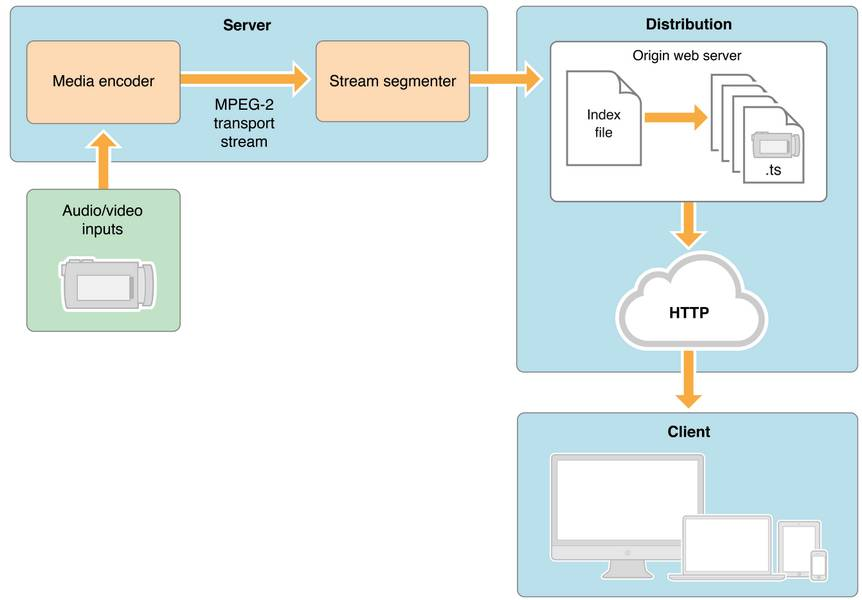
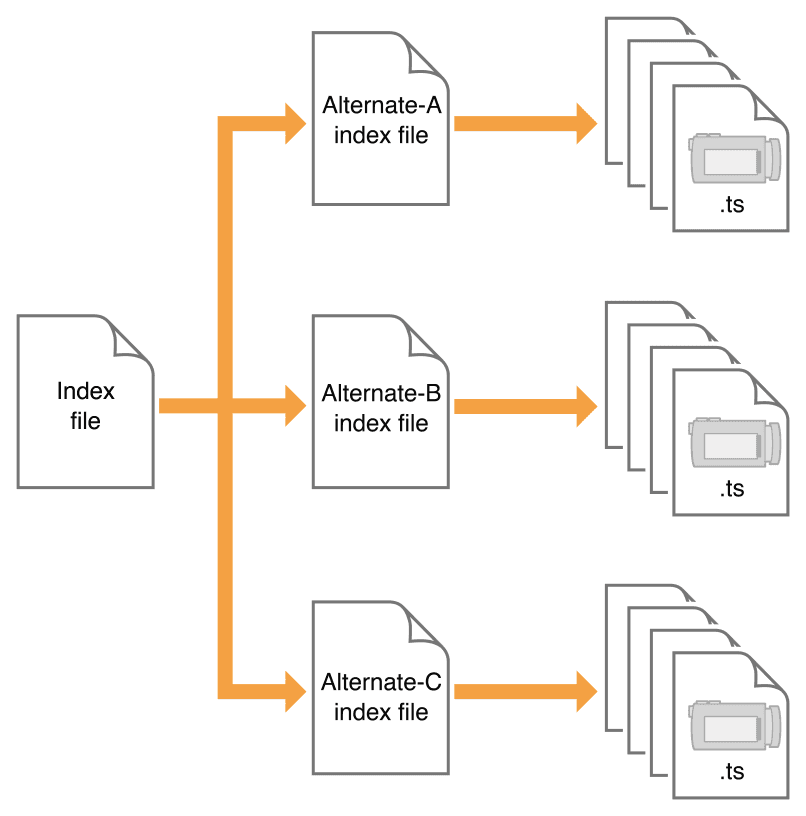
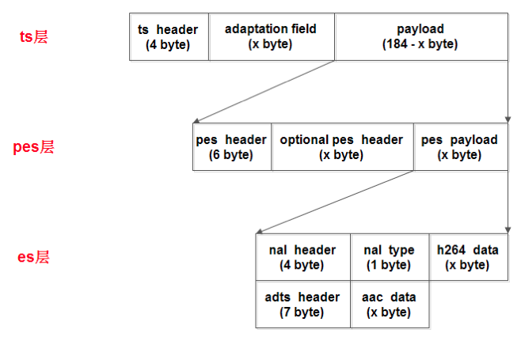

# HLS协议

---

## General

HLS (HTTP Live Streaming), 是由 Apple 公司实现的基于 HTTP 的媒体流传输协议。他跟 DASH 协议的原理非常类似，通过将整条流切割成一个小的可以通过 HTTP 下载的媒体文件，然后提供一个配套的媒体列表文件给客户端，让客户端顺序地拉取这些媒体文件播放, 来实现看上去是在播放一条流的效果。HLS 目前广泛地应用于点播和直播领域。

常用的流媒体协议主要有 HTTP 渐进下载和基于 RTSP/RTP 的实时流媒体协议，这二种基本是完全不同的东西，目前比较方便又好用的是用 HTTP 渐进下载方法。在这个中 apple 公司的 HTTP Live Streaming 是这个方面的代表。它最初是苹果公司针对iPhone、iPod、iTouch和iPad等移动设备而开发的流.现在见到在桌面也有很多应用了，[HTML5](http://www.kokojia.com/list/271.html) 是直接支持这个。但是HLS协议的小切片方式会生成大量的文件，存储或处理这些文件会造成大量资源浪费。如果要实现数天的时移，索引量将会是个巨额数字，并明显影响请求速度。因此，HLS协议对存储I/O要求相当苛刻。对此，也有公司提出了非常好的解决方案。

目前有一部分新型点播服务器系统，独创了内存缓存数据实时切片技术，颠覆了这种传统实现方法，从根本上解决了大量切片的碎片问题，使得单台服务器的切片与打包能力不再是瓶颈。其基本原理如下：不将TS切片文件存到磁盘，而是存在内存当中，这种技术使得服务器的磁盘上面不再会有“数以吨计”的文件碎片，极大减少了磁盘的I/O次数，延长了服务器磁盘的使用寿命，极大提高了服务器运行的稳定性。同时，由于使用这种技术，使得终端请求数据时直接从服务器的内存中获取，极大提高了对终端数据请求的反应速度，优化了视频观看体验。

---

## HLS优势

* 客户端支持简单，只需要支持 HTTP 请求即可，HTTP 协议无状态，只需要按顺序下载媒体片段即可。
* 使用 HTTP 协议网络兼容性好， HTTP 数据包也可以方便地通过防火墙或者代理服务器，CDN 支持良好。
* 自带多码率自适应，Apple 在提出 HLS 时，就已经考虑了码率自适应的问题。

## HLS劣势

* 相比 RTMP 这类长连接协议，延时较高，难以用到互动直播场景。
* 对于点播服务来说，由于 TS 切片通常较小，海量碎片在文件分发、一致性缓存、存储等方面都有较大挑战。

---

## 协议详解

来解释一下这张图，从左到右讲，左下方的inputs的视频源是什么格式都无所谓，他与server之间的通信协议也可以任意（比如RTMP），总之只要把视频数据传输到服务器上即可。这个视频在server服务器上被转换成HLS格式的视频（既TS和m3u8文件）文件。细拆分来看server里面的Media encoder的是一个转码模块负责将视频源中的视频数据转码到目标编码格式（H264）的视频数据，视频源的编码格式可以是任何的视频编码格式（参考[《视频技术基础》](https://www.jianshu.com/p/c905f3ec59c9的封装格式章节)）。转码成H264视频数据之后，在stream segmenter模块将视频切片，切片的结果就是index file（m3u8）和ts文件了。图中的Distribution其实只是一个普通的HTTP文件服务器，然后客户端只需要访问一级index文件的路径就会自动播放HLS视频流了。

上图可以看出，HLS总共有三个部分: Serve、CDN、Client。HLS 协议的主要内容是关于 M3U8 这个文本协议，其实生成与解析都非常简单，示例如下：

- HLS 通过 URI(RFC3986) 指向的一个 Playlist 来表示一个媒体流.
- 一个 Playlist 可以是一个 Media Playlist 或者 Master Playlist, 使用 UTF-8 编码的文本文件, 包含一些 URI 跟描述性的 tags.
- 一个 Media Playlist 包含一个 Media Segments 列表,当顺序播放时, 能播放整个完整的流.
- 要想播放这个 Playlist, 客户端需要首先下载他, 然后播放里面的每一个 Media Segment.
- 更加复杂的情况是, Playlist 是一个 Master Playlist, 包含一个 Variant Stream 集合, 通常每个 Variant Stream 里面是同一个流的多个不同版本(如: 分辨率, 码率不同).

### HLS的index文件

所谓index文件就是之前说的m3u8文本文件。

如上图所示，客户端播放HLS视频流的逻辑其实非常简单，先下载一级Index file，它里面记录了二级索引文件（Alternate-A、Alternate-B、Alternate-C）的地址，然后客户端再去下载二级索引文件，二级索引文件中又记录了TS文件的下载地址，这样客户端就可以按顺序下载TS视频文件并连续播放。

### HLS Media Segments

- 每一个 Media Segment 通过一个 URI 指定, 可能包含一个 byte range.
- 每一个 Media Segment 的 duration 通过 EXTINF tag 指定.
- 每一个 Media Segment 有一个唯一的整数 Media Segment Number.
- 有些媒体格式需要一个 format-specific sequence 来初始化一个 parser, 在 Media Segment 被 parse 之前. 这个字段叫做 Media Initialization Section, 通过 EXT-X-MAP tag 来指定.

### 支持的Media Segment格式

* #####MPEG-2 Transport Streams
  * 即最常见的 TS 文件.
  * RFC: ISO_13818.
  * Media Initialization Section: PAT(Program Association Table) 跟 PMT(Program Map Table).
  * 每个 TS segment 必须值含一个 MPEG-2 Program.
  * 每个 TS segment 包含一个 PAT 和 PMT, 最好在 segment 的开始处, 或者通过一个 EXT-X-MAP tag 来指定.

* #####Fragmented MPEG-4
  * 即常提到的 fMP4.
  * RFC: ISOBMFF.
  * Media Initialization Section: ftyp box(包含一个高于 ios6 的 brand), ftyp box 必须紧跟在 moov box 之后. moov box 必须包含一个 trak box(对于每个 fMP4 segment 里面的 traf box, 包含匹配的 track_ID). 每个 trak box 应该包含一个 sample table, 但是他的 sample count 必须为 0. mvhd box 跟 tkhd 的 duration 必须为 0. mvex box 必须跟在上一个 trak box 后面.
  * 不像普通的 MP4 文件包含一个 moov box(包含 sample tables) 和一个 mdat box(包含对应的 samples), 一个 fMP4 包含一个 moof box (包含 sample table 的子集), 和一个 mdat box(包含对应的 samples).
  * 在每一个 fMP4 segment 里面, 每一个 traf box 必须包含一个 tfdt box, fMP4 segment 必须使用 movie-fragment relative addressing. fMP4 segments 绝对不能使用外部的 data references.
  * 每一个 fMP4 segment 必须有一个 EXT-X-MAP tag.

* ##### Packed Audio

* ##### WebVTT

* #### HLS Playlists

* ##### Attribute Lists

* ##### Basic Tags

* ##### Media Segment Tags

* ##### Media Playlist Tags

* ##### Master Playlist Tags

* ##### Media or Master Playlist Tags

---

##服务器端与客户端逻辑

#### 服务器端逻辑

- 将媒体源切片成 Media Segment, 应该优先从可以高效解码的时间点来进行切片(如: I-frame).
- 为每一个 Media Segment 生成 URI.
- Server 需要支持 “gzip” 方式压缩文本内容.
- 创建一个 Media Playlist 索引文件, EXT-X-VERSION 不要高于他需要的版本, 来提供更好的兼容性.
- Server 不能随便修改 Media Playlist, 除了 Append 文本到文件末尾, 按顺序移除 Media Segment URIs, 增长 EXT-X-MEDIA-SEQUENCE 和 EXT-X-DISCONTINUITY-SEQUENCE, 添加 EXT-X-ENDLIST 到文件尾.
- 在最后添加 EXT-X-ENDLIST tag, 来减少 Client reload Playlist 的次数.
- **注意点播与直播服务器不同的地方是, 直播的 m3u8 文件会不断更新, 而点播的 m3u8 文件是不会变的, 只需要客户端在开始时请求一次即可.**

#### 客户端逻辑

- 客户端通过 URI 获取 Playlist. 如果是 Master Playlist, 客户端可以选择一个 Variant Stream 来播放.
- 客户端检查 EXT-X-VERSION 版本是否满足.
- 客户端应该忽略不可识别的 tags, 忽略不可识别的属性键值对.
- 加载 Media Playlist file.
- 播放 Media Playlist file.
- 重加载 Media Playlist file.
- 决定下一次要加载的 Media Segment.

---

##HLS优化技术

由于客户端每次请求 TS 或 M3U8 有可能都是一个新的连接请求，所以,我们无法有效的标识客户端，一旦出现问题，基本无法有效的定位问题，因此一般工业级的服务器都会对传统的 HLS 做一些改进。

#### 302

首先在客户端第一次进行拉流请求的时候，服务器会做一个302的跳转。

#### uuid

在302跳转后产生的新的url上，服务器会给url加上一个uuid，用来定位可能的问题。

---

##TS文件详解

m3u8只是一个传输格式，一个典型的m3u8文件，最终的音视频数据流都是封装在.ts文件中，ts文件的全称是**MPEG-2 Transport Streams**，下面来分析一下这个文件的具体结构。

#### 文件结构

视频编码主要格式是h264/mpeg4,音频编码格式主要是acc/mp3

ts文件分为三层：

- ts(TransportStream)主要是音视频数据
- pes(PacketElementalStream)在音视频数据（ts）上加了时间戳等数据说明信息
- es(ElementaryStream)在（pes）上加入数据流的识别和传输必须信息

[http://llyblog.com/2018/08/09/HLS%E5%8D%8F%E8%AE%AE%E8%AF%A6%E8%A7%A3/](http://llyblog.com/2018/08/09/HLS协议详解/)

https://www.jianshu.com/p/426425cad08a

